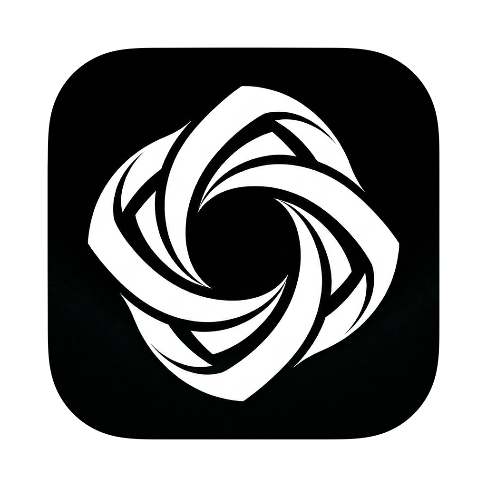

<p align="center">
  
</p>

<h1 align="center">OXOX</h1>

<p align="center">
  An open-source desktop client for <a href="https://factory.ai">Factory AI's Droid</a>.
</p>

<p align="center">
  
  
  
</p>

---

OXOX gives you a native GUI for managing Droid sessions instead of juggling terminal tabs, session IDs, and CLI flags. All your sessions in one window (or multiple windows), searchable, pinnable, archivable, forkable, rewindable.

If you use Factory's official desktop app but want to change how things work, clone this repo and make it yours.

## What you get

- **Session list with search and filtering** -- every session across all your projects, grouped and filterable by project, status, date range, or free text search. Pin the ones you care about. Archive the rest.
- **Live transcript rendering** -- watch Droid work in real time. Thinking indicators, tool calls with inline diffs, permission requests, interactive ask-user flows, code blocks with syntax highlighting, web search results, terminal output, todo lists.
- **Multi-window support** -- open multiple windows, attach different sessions to each. Viewer counts track who's looking at what.
- **Session operations** -- create, fork, rewind (restore files from any point in a session's history), compact, interrupt, rename. All from the GUI.
- **Command palette** -- quick session search and app actions via `Cmd+K`.
- **Plugin system** -- local plugins run in isolated Node.js child processes with sandboxed permissions. Register capabilities that show up in the command palette.
- **Daemon integration** -- connects to the Factory daemon over WebSocket for session discovery, search, and remote operations.

## Prerequisites

- **macOS** (only platform with build targets right now)
- **Node.js** 18+
- **pnpm**
- **Factory Droid CLI** installed and on your PATH ([install instructions](https://docs.factory.ai))

## Getting started

```bash
git clone https://github.com/theadriann/oxox.git
cd oxox
```

The project depends on `@factory/droid-sdk`, which currently links to a local path. Clone the SDK repo alongside this one:

```bash
cd ..
git clone https://github.com/Factory-AI/droid-sdk-typescript.git
cd oxox
```

> The SDK is published on npm, but we're currently using a local link to get the latest unreleased changes. Once a new version is published, this step won't be needed.

Install dependencies and run:

```bash
pnpm install
pnpm dev
```

The renderer dev server starts on port 3105. Electron opens automatically.

## Scripts

| Command | What it does |
|---|---|
| `pnpm dev` | Start in development mode with hot reload |
| `pnpm build` | Build main, preload, and renderer to `out/` |
| `pnpm start` | Preview the production build |
| `pnpm package` | Build + package as unpacked macOS app in `release/` |
| `pnpm dist` | Build + package as DMG and ZIP in `release/` |
| `pnpm test` | Run tests with Vitest |
| `pnpm typecheck` | TypeScript type checking |
| `pnpm lint` | Lint with Biome |
| `pnpm format` | Format with Biome |

## Architecture

```
src/
├── main/                  Electron main process
│   ├── app/               AppKernel, service + plugin registries
│   ├── integration/       Core logic: sessions, daemon, database, artifacts, plugins
│   ├── ipc/               IPC router (36 channels)
│   ├── windows/           Multi-window coordinator, state persistence
│   ├── native/            Tray, dock, notifications, menus
│   └── lifecycle/         Graceful shutdown, single instance lock
├── preload/               Typed bridge exposed as window.oxox
├── renderer/              React app
│   ├── components/        UI (app shell, sidebar, transcript, settings, 57 shadcn components)
│   ├── stores/            19 MobX stores + event bus
│   ├── hooks/             14 React hooks
│   └── platform/          API client + persistence abstractions
└── shared/                IPC contracts, plugin types, design tokens
```

Main process owns all state and business logic. The renderer talks to it through a typed IPC bridge -- no direct `window.oxox` access in production code.

State management uses MobX stores composed by a `RootStore`, with a `StoreEventBus` to keep stores decoupled from each other. The renderer takes all dependencies through constructor injection, so stores are testable without Electron.

## Tech stack

Electron 41, React 19, MobX 6, Tailwind CSS 4, shadcn/ui (radix-nova), Framer Motion, electron-vite, Vitest, Biome, TypeScript 5.9, better-sqlite3.

## Contributing

The codebase has 113 test files. If you're adding something, write tests for it.

```bash
pnpm test          # run the suite
pnpm typecheck     # make sure types are clean
pnpm lint          # biome catches the rest
```

The project uses Biome for formatting and linting -- 2-space indentation, single quotes, no semicolons, trailing commas. Run `pnpm format` before committing or configure your editor to format on save.

Fork it, change it, break it, fix it, send a PR. Or just clone it and make it your own.

## License

[MIT](LICENSE)
